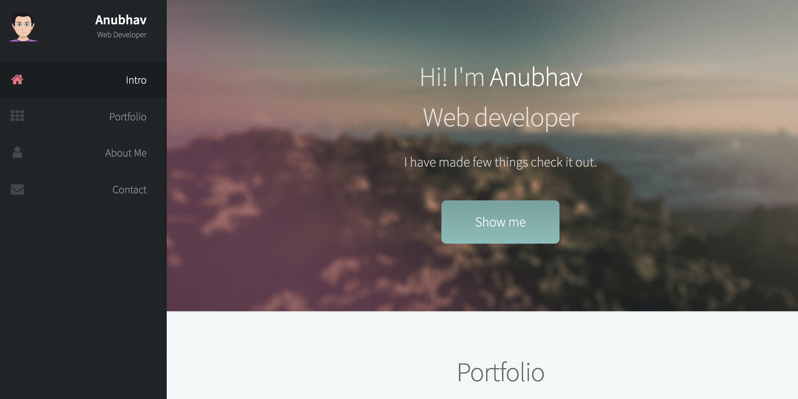

<!-- PROJECT LOGO -->
<br />
<p align="center">
  
    
 

  <h3 align="center">This is My Portfolio Site</h3>

  <p align="center">
    An awesome Gatsby static site!
    <br />
    
  </p>
</p>


<!-- TABLE OF CONTENTS -->
## Table of Contents

* [About the Project](#about-the-project)
  * [Built With](#built-with)
* [Getting Started](#getting-started)
  * [Prerequisites](#prerequisites)
  * [Installation](#installation)
* [Usage](#usage)
* [Contributing](#contributing)
* [License](#license)
* [Contact](#contact)


<!-- ABOUT THE PROJECT -->
## About The Project

[![Product Name Screen Shot][product-screenshot]](https://example.com)

This is my porfolio site that I created using Gastby. Hope you like it.


* Gatsby is a static site generator.
* Fast, Safe and secure.
*  :smile:


### Built With

* Gatsby
* React Modal
* Scrollspy
* Smoothscroll-Polyfill


<!-- GETTING STARTED -->
## Getting Started

## Install

Make sure that you have the Gatsby CLI program installed:

```sh
npm install --global gatsby-cli
```

And run from your CLI:

```sh
gatsby new <site-name> https://github.com/anubhavsrivastava/gatsby-starter-prologue
```

Then you can run it by:

```sh
cd gatsby-example-site
npm install
gatsby develop
```


### Prerequisites

### Personalization

Edit `config.js` to put up your details

```javascript
module.exports = {
  siteTitle: 'Gatsby Starter Prologue', // <title>
  ...
  authorName: 'Anubhav Srivastava',
  heading: 'Web Developer',
  // social
  socialLinks: [
    {
      icon: 'fa-github',
      name: 'Github',
      url: 'https://github.com/anubhavsrivastava',
    }
    ...
  ],
};

```

### Installation


1. Clone the repo
```sh
git clone https://github.com/lalebdi/myPortfolio
```
2. Install NPM packages
```sh
npm install
```


<!-- USAGE EXAMPLES -->
## Usage

Use this space to show useful examples of how a project can be used. Additional screenshots, code examples and demos work well in this space. You may also link to more resources.

_For more examples, please refer to the [Documentation](https://example.com)_


<!-- CONTRIBUTING -->
## Contributing

Contributions are what make the open source community such an amazing place to be learn, inspire, and create. Any contributions you make are **greatly appreciated**.

1. Fork the Project
2. Create your Feature Branch (`git checkout -b feature/AmazingFeature`)
3. Commit your Changes (`git commit -m 'Add some AmazingFeature'`)
4. Push to the Branch (`git push origin feature/AmazingFeature`)
5. Open a Pull Request


<!-- LICENSE -->
## License

Distributed under the MIT License. See `LICENSE` for more information.


<!-- CONTACT -->
## Contact


Project Link: [https://github.com/lalebdi/myPortfolio](https://github.com/lalebdi/myPortfolio)


# gatsby-starter-prologue

Gatsby.js V2 starter template based on Prologue by HTML5 UP

For an overview of the project structure please refer to the [Gatsby documentation - Building with Components](https://www.gatsbyjs.org/docs/building-with-components/).


Check online preview [here](https://anubhavsrivastava.github.io/gatsby-starter-prologue/)

## Screenshot



## Install

Make sure that you have the Gatsby CLI program installed:

```sh
npm install --global gatsby-cli
```

And run from your CLI:

```sh
gatsby new <site-name> https://github.com/anubhavsrivastava/gatsby-starter-prologue
```

Then you can run it by:

```sh
cd gatsby-example-site
npm install
gatsby develop
```

### Personalization

Edit `config.js` to put up your details

```javascript
module.exports = {
  siteTitle: 'Gatsby Starter Prologue', // <title>
  ...
  authorName: 'Anubhav Srivastava',
  heading: 'Web Developer',
  // social
  socialLinks: [
    {
      icon: 'fa-github',
      name: 'Github',
      url: 'https://github.com/anubhavsrivastava',
    }
    ...
  ],
};

```

### Deploying using Github page

`package.json` has a default script that uses `gh-pages` module to publish on Github pages. Simply running `npm run deploy` would publish the site on github pages.

Additionally, it also has [path-prefix](https://www.gatsbyjs.org/docs/path-prefix/) value set for gatsby config in `config.js`. Change `pathPrefix` to relevant path if your gatsby site is hosted on subpath of a domain, `https://theanubhav.com/somePath/`. If you are hosting it as root site, i.e, `https://theanubhav.com/` , remove the pathPrefix configuration.

### Checkout other similar starters

- [gatsby-starter-casual](https://github.com/anubhavsrivastava/gatsby-starter-casual)
- [gatsby-starter-grayscale](https://github.com/anubhavsrivastava/gatsby-starter-grayscale)
- [gatsby-starter-resume](https://github.com/anubhavsrivastava/gatsby-starter-resume)
- [gatsby-starter-spectral](https://github.com/anubhavsrivastava/gatsby-starter-spectral)
- [gatsby-starter-newage](https://github.com/anubhavsrivastava/gatsby-starter-newage)
- [gatsby-starter-stylish](https://github.com/anubhavsrivastava/gatsby-starter-stylish)
- [gatsby-starter-solidstate](https://github.com/anubhavsrivastava/gatsby-starter-solidstate)
- [gatsby-starter-readonly](https://github.com/anubhavsrivastava/gatsby-starter-readonly) 
- [gatsby-starter-phantom](https://github.com/anubhavsrivastava/gatsby-starter-phantom)
- [gatsby-starter-paradigmshift](https://github.com/anubhavsrivastava/gatsby-starter-paradigmshift)
- [gatsby-starter-overflow](https://github.com/anubhavsrivastava/gatsby-starter-overflow)
- [gatsby-starter-multiverse](https://github.com/anubhavsrivastava/gatsby-starter-multiverse)
- [gatsby-starter-identity](https://github.com/anubhavsrivastava/gatsby-starter-identity)
- [gatsby-starter-highlights](https://github.com/anubhavsrivastava/gatsby-starter-highlights)
- [gatsby-starter-fractal](https://github.com/anubhavsrivastava/gatsby-starter-fractal)
- [gatsby-starter-eventually](https://github.com/anubhavsrivastava/gatsby-starter-eventually)
- [gatsby-starter-directive](https://github.com/anubhavsrivastava/gatsby-starter-directive)
- [gatsby-starter-creative](https://github.com/anubhavsrivastava/gatsby-starter-creative)
- [gatsby-starter-aerial](https://github.com/anubhavsrivastava/gatsby-starter-aerial)

### Contribution

Suggestions and PRs are welcome!

Please create issue or open PR request for contribution.

### License

[](LICENSE)

refer `LICENSE` file in this repository.
